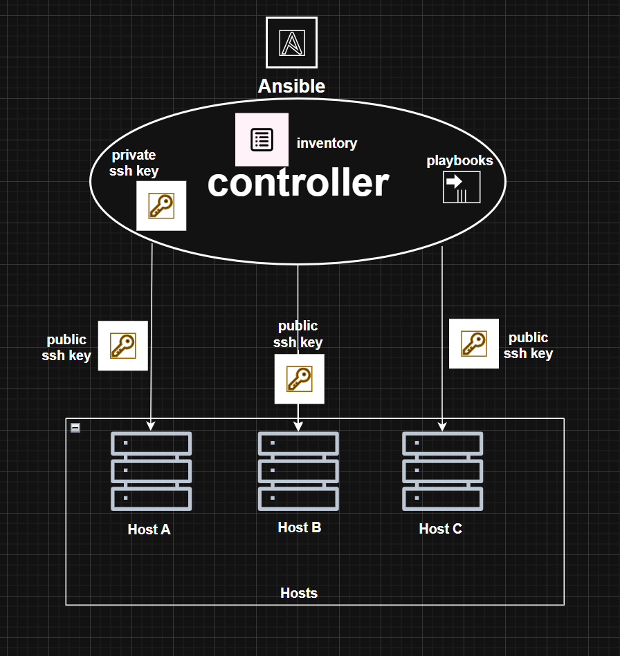

# Ansible Playbooks Repository

This repository contains production-ready Ansible playbooks that orchestrate infrastructure deployments across on-premises and AWS environments. The playbooks consume standardized, versioned collections from the `ansible-collections` repository and are designed to work seamlessly with automation controller, manual and CI/CD automation workflows.

## Architecture Overview

### Control Host and Remote Host Relationship
- 

### SSH Key-Based Authentication

All communication between the control host and remote hosts uses **SSH key-based authentication** for security and auditability:

- **Control Host:** Stores private SSH keys in `~/.ssh/` with restricted permissions (`600`)
- **Remote Hosts:** Have corresponding public keys installed in `~/.ssh/authorized_keys`
- **Benefits:**
  - No password exposure in logs or configuration files
  - Audit trail of which control host accessed which remote hosts
  - Easy to rotate or revoke access without password changes
  - Supports automated deployments without human interaction
  - Integrates seamlessly with CI/CD systems (GitHub Actions, Jenkins, etc.)

### Connection Flow

1. Ansible control host reads private SSH key
2. Initiates SSH connection to remote host on port 22
3. Presents private key for authentication
4. Remote host verifies against authorized public key
5. If verified, SSH session established and playbook tasks execute
6. Output captured and returned to control host

---

## Private Collection Management Strategy

### Why Nexus + requirements.sh Instead of Galaxy Server?

This repository uses a lightweight, secure approach to manage private Ansible collections without the overhead of a dedicated Galaxy server:

#### **1. Simplicity & Low Overhead**
- **Nexus:** Universal artifact repository already in use; no additional infrastructure or services required
- **Galaxy Server:** Requires dedicated server, database, web interface, and ongoing maintenance
- **requirements.sh:** Simple script with no framework or complex dependencies
- **Result:** Minimal operational burden, quick to deploy, easy to understand

#### **2. Security without Credential Exposure**
- **Nexus credentials:** Only stored on control host or CI/CD server workflow
- **requirements.sh:** Uses environment variables or command-line arguments; credentials never logged
- **SSH Keys:** Remote hosts never see Nexus credentials; only receive deployed roles/content

#### **3. Lightweight & Adaptable**
- **No extra infrastructure:** Nexus is already running; reuse existing service
- **No database complexity:** No schema upgrades, no migration concerns
- **Flexible distribution:** Collections stored as `.tar.gz` artifacts (standard format)
- **Portable:** Works in any environment: development or CI/CD pipeline
- **Result:** Deploy anywhere without special setup; adapt deployment method without code changes

#### **4. CI/CD Compatibility**
- **Manual Deployment:** `./requirements.sh $NEXUS_USER $NEXUS_PASS collections.txt`
- **GitHub Actions / Jenkins:** Pass secrets as environment variables; script handles the rest
- **No special integrations needed:** Just standard bash, curl, and ansible-galaxy (standard tools)
- **Galaxy Server:** Requires custom auth setup, token management, and integration code
- **Result:** Single approach works for laptop, CI/CD, or manual use cases

#### **5. Full Compatibility with Standard Ansible**
- Collections downloaded from Nexus are 100% standard Ansible collection format
- No proprietary wrapper or special handling
- Works with `ansible-galaxy collection install` directly
- Portable artifacts can be used with or without Nexus (manual transfer, S3, HTTP, etc.)
- Disaster recovery: collections stay usable even if Nexus goes down (use cached artifacts on the controller)

---

## Repository Structure

```
ansible-playbooks/
 README.md                  # This file
 LICENSE                    # Repository license
 ansible.cfg               # Ansible configuration
 requirements.sh           # Collection installation script (Nexus  ansible-galaxy)
 collections.txt           # List of collection URLs in Nexus repository
 playbooks/                # Ansible playbooks (entry points)
    init_user.yml        # Initialize users and groups
    init_webserver.yml   # Deploy and configure web servers
 inventory/                # Host and group definitions
    dev/                 # Development environment
       hosts.yml        # Host inventory (on-premises & AWS)
       group_vars/      # Group-level variables
       host_vars/       # Host-specific variables
    staging/             # Staging environment (when needed)
 ansible_collections/     # Local collection cache
 .git/                    # Version control
```

---

## Playbooks

### **init_user.yml**  User and Group Initialization

**Collections Used:** `adams.shared`

**Roles Executed:**
1. `add_group_role` - Define system groups
2. `add_user_role` - Create users with SSH access

**Usage:**

```bash
# Run against development environment
ansible-playbook -i inventory/dev playbooks/init_user.yml

# Run against specific group
ansible-playbook -i inventory/dev playbooks/init_user.yml -l frontend

```

### **init_webserver.yml**  Web Server Deployment

**Collections Used:** `adams.webservers`

**Roles Executed:**
1. `bootstrap_setup_role` - Prepare server environment
2. `webservers_role` - Install and start web services

**Usage:**

```bash
# Deploy to all web servers
ansible-playbook -i inventory/dev playbooks/init_webserver.yml

# Deploy to on-premises frontend servers only
ansible-playbook -i inventory/dev playbooks/init_webserver.yml -l onprem_frontend

# Deploy to AWS backend servers only
ansible-playbook -i inventory/dev playbooks/init_webserver.yml -l aws_backend
```

---

## Inventory Organization

### Environment Structure

The inventory is organized by **environment** (dev, staging, production) and further divided by **infrastructure location** and **application tier**:

```
Inventory Hierarchy:

 On-Premises Infrastructure
    onp_adams (project group)
       onp-adams-fe-01 (frontend)
       onp-adams-be-01 (backend)
    onp_ade (project group)
    onp_vitae (project group)

 AWS Cloud Infrastructure
    aws_adams (project group)
    aws_ade (project group)
    aws_vitae (project group)

 Meta Groups (for playbook targeting)
    frontend (all frontend servers across locations)
    backend (all backend servers across locations)
    onprem (all on-premises servers)
    aws (all AWS instances)
    adams (all servers for adams project)
    ade (all servers for ade project)
    vitae (all servers for vitae project)
```

### Group Variables

Group-level variables set configuration for all hosts in a group:
- `inventory/dev/group_vars/adams.yml`  Variables for adams project
- `inventory/dev/group_vars/ade.yml`  Variables for ade project
- `inventory/dev/group_vars/vitae.yml`  Variables for vitae project
- `inventory/dev/group_vars/onprem.yml`  On-premises specific config
- `inventory/dev/group_vars/all/all.yml`  Global variables for all hosts

### Host Variables

Host-specific variables override group defaults:
- `inventory/dev/host_vars/<hostname>.yml`  Per-host configuration

---

## Setup and Installation

### Prerequisites

**Control Host Requirements:**
- Linux/macOS with bash shell
- Ansible 2.9+ installed
- Python 3.8+ (for Ansible)
- SSH client with key-based authentication configured
- `curl` command-line tool (for downloading from Nexus)
- Git (for version control)

**Remote Host Requirements:**
- Linux (RHEL, CentOS, Ubuntu, Debian)
- SSH server running and accessible on port 22
- Sudo or root access for privilege escalation (`become: true`)
- Python 2.7+ or Python 3.6+ (for Ansible module execution)

### Installation Steps

#### 1. Clone Repository

```bash
git clone <repository-url> ansible-playbooks
cd ansible-playbooks
```

#### 2. Set Up SSH Keys

On **control host**, generate or use existing SSH key pair:

```bash
# Generate new key (if needed)
ssh-keygen -t ed25519 -f ~/.ssh/id_ed25519 -C "ansible@controlhost"

# Set proper permissions
chmod 600 ~/.ssh/id_ed25519
chmod 644 ~/.ssh/id_ed25519.pub
```

On **remote hosts**, add control host public key:

```bash
# Copy public key to remote host
ssh-copy-id -i ~/.ssh/id_ed25519.pub ansible@remote_ip
```

#### 3. Install Collections from Nexus

Before running playbooks, download and install collections:

```bash
# Run requirements script with Nexus credentials
./requirements.sh $NEXUS_USER $NEXUS_PASSWORD collections.txt
```

#### 4. Configure Inventory

Update `inventory/dev/hosts.yml` with:
- Correct IP addresses or FQDNs for remote hosts
- Add/remove hosts as needed
- Adjust group membership

#### 5. Test Connectivity

```bash
# Test SSH connection and Ansible ping
ansible -i inventory/dev all -m ping

# Expected output: "pong" from all hosts
```

---

## Running Playbooks

### Basic Execution

```bash
# Run against all hosts in development inventory
ansible-playbook -i inventory/dev playbooks/init_user.yml
```

### Targeting Specific Hosts/Groups

```bash
# Run against specific group
ansible-playbook -i inventory/dev playbooks/init_user.yml -l frontend

# Run against single host
ansible-playbook -i inventory/dev playbooks/init_user.yml -l onp-adams-fe-01
```

### Dry Run (Check Mode)

```bash
# Preview changes without applying them
ansible-playbook -i inventory/dev playbooks/init_user.yml --check
```

### Limiting Execution (Tags)

Roles define tags fro deploy, rollback and update

```bash
# Run plabooks with tags per deployment configuration for deploy"
ansible-playbook -i inventory/dev playbooks/init_user.yml --tags deploy

# Run plabooks with tags per deployment configuration for rollback"
ansible-playbook -i inventory/dev playbooks/init_user.yml --tags rollback
```

### collections.txt

List of collection artifact URLs in Nexus repository:

```
http://192.168.100.14:8081/repository/ansible_collections/adams-shared-1.0.0.tar.gz
http://192.168.100.14:8081/repository/ansible_collections/adams-webservers-1.0.1.tar.gz
```

Update this file when:
- New collection versions are released
- Collections are moved or renamed
- Nexus repository configuration changes

---

## Troubleshooting

### SSH Connection Issues

```bash
# Test SSH connectivity manually
ssh -i ~/.ssh/id_ed25519 user@remote_host "echo connected"

# Test with Ansible (verbose SSH debug)
ansible -i inventory/dev all -m ping -vvv

# Check SSH key permissions
ls -la ~/.ssh/id_*         # Private key should be 600
```

### Collection Installation Failures

```bash
# Verify Nexus URLs are correct
cat collections.txt

# Test curl download manually. Example
curl -u "$NEXUS_USER:$NEXUS_PASSWORD" "http://192.168.100.14:8081/repository/ansible_collections/adams-shared-1.0.0.tar.gz" -O adams-shared-1.0.0.tar.gz

# Check installed collections
ansible-galaxy collection list

# Reinstall collections (remove old, install new)
rm -rf ansible_collections/
./requirements.sh "$NEXUS_USER" "$NEXUS_PASSWORD" collections.txt
```

### Playbook Syntax Errors

```bash
# Perform a dry run
ansible-playbook -i inventory/dev playbooks/init_user.yml --check
```

---

## Best Practices

1. **Use SSH Keys:** Never use passwords for Ansible; always use SSH key-based authentication
2. **Separate Environments:** Maintain distinct inventories for dev, staging, and production
3. **Version Collections:** Pin specific collection versions in `collections.txt` for reproducibility
4. **Test Changes:** Always run playbooks with `--check` before applying to production
5. **Document Variables:** Keep `inventory/*/group_vars/` well-documented and version-controlled
6. **Limit Parallelism:** Adjust `forks` setting in `ansible.cfg` based on network capacity
7. **Monitor Execution:** Use verbose mode (`-v`, `-vv`, `-vvv`) for debugging
8. **Secure Credentials:** Never commit secrets; use environment variables or credential management systems
9. **Rollback Strategy:** Test rollback scenarios with `--check` before running in production

---

## Support and Contributing

For issues or improvements:
1. Open an issue in the repository
2. Include verbose output from failing playbooks
3. Describe environment and versions (Ansible, Python, OS)
4. Propose changes via pull requests

---

## License

This repository is licensed under GPL-2.0-or-later. See `LICENSE` file for details.

---

## Related Repositories

- **ansible-collections**  Source collections (shared, webservers)
- **Infrastructure-IaC**  Infrastructure as Code definitions (Terraform, CloudFormation)
